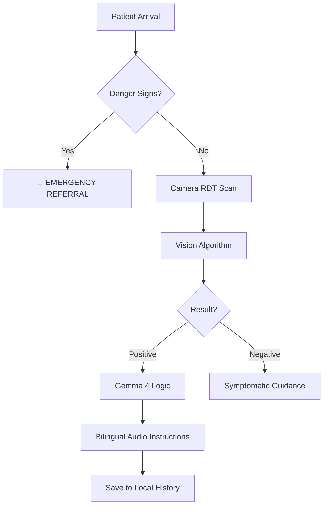

# MalariaGuard: Clinical Decision Support for a Malaria-Free Future 🩺✨

[](https://developer.google.com/gemma)
[](https://github.com/hizkyas/Malaria-Clinical-Decision-Support-Tool/actions/workflows/quality_gate.yml)
[](https://github.com/hizkyas/Malaria-Clinical-Decision-Support-Tool/actions/workflows/build_android.yml)
[](https://opensource.org/licenses/MIT)

---

## 🌍 The Mission: Gemma 4 Good

**MalariaGuard** was developed for the **Gemma 4 Good Hackathon** to address a critical healthcare gap in rural Ethiopia. In many regions, the doctor-to-patient ratio is severely strained, leaving **Health Extension Workers (HEWs)** to manage complex clinical cases with limited real-time support. 

By leveraging **Gemma Nano**, we bring world-class clinical reasoning directly to the frontline—completely offline, bilingual, and protocol-compliant.

> "Our goal is to ensure that no child or adult in rural Ethiopia is more than a smartphone's reach away from protocol-standard malaria care."

---

## 🌟 Visionary Features


### 🧠 Pillar 1: Hybrid Intelligence (Gemma 4 + Rule Engine)
- **Local LLM**: Integrated via `gemini_nano_android`, the app uses **Gemma 4** to provide personalized treatment recommendations based on the **2022 Ethiopian National Malaria Guidelines**.
- **Deterministic Fallback**: For safety-critical cases, a robust rule-based engine derived from the clinical protocol acts as a secondary verification layer.
- **Privacy First**: All patient data stays on-device; no cloud connection is ever required.

### 🔬 Pillar 2: Computer Vision RDT Scanner
- **Zero-Entry Diagnostics**: Uses a custom pixel-intensity profiling algorithm to detect "Control" and "Test" lines on Rapid Diagnostic Test (RDT) strips.
- **Augmented Reality Guide**: A real-time camera overlay with high-speed "laser" animations 🔴 ensures perfect strip alignment.
- **Workflow Automation**: Detected results automatically trigger the AI dosage calculation, reducing manual input errors.

### 🎙️ Pillar 3: Specialized Accessibility
- **Amharic Voice-to-Text**: Hands-free data entry for patient characteristics using advanced speech recognition configured for the Ethiopian locale.
- **Audio Guard (TTS)**: Bilingual (English/Amharic) audio instructions read aloud clinical dosages and emergency warnings, acting as a crucial "second pair of eyes" for the health worker.

### 🚨 Pillar 4: Safety & Clinical Integrity
- **Emergency Flagging**: Automatic high-priority alerts for "Danger Signs" (e.g., Unconsciousness, Convulsions) with immediate "REFER TO HOSPITAL" protocols.
- **Audit Trail**: Every diagnosis is logged in a secure, local SQLite database for epidemiological tracking.

---

## 🏗️ Technical Architecture



### Tech Stack
| Component | Technology |
| :--- | :--- |
| **Core Framework** | Flutter 3.24 (Dart) |
| **Local AI** | Google Gemini Nano (Gemma 4) via AICore |
| **Vision** | Image Package + Pixel Intensity Profiling |
| **Database** | SQLite (sqflite) |
| **Audio** | Speech-to-Text & Flutter TTS (Amharic support) |
| **DevOps** | GitHub Actions (CI/CD) |

---

## 📂 Project Structure

```bash
malariaguard/
├── .github/workflows/    # 7 Professional Pipelines (Security, Releases, Quality)
├── malariaguard_app/     # Core Mobile Application
│   ├── assets/           # Medical protocols & clinical assets
│   ├── lib/              # Modular feature-driven architecture
│   └── android/          # Optimized for Android 14+ (API 34)
├── .gitignore            # Multi-language project ignore settings
├── LICENSE               # MIT Open Source License
└── test_logic.py         # Advanced clinical logic validation suite
```

---

## 🛠️ Setup & Installation

To run MalariaGuard on your local development machine:

1.  **Prerequisites**:
    *   Flutter SDK (v3.24.0 or higher)
    *   Android Studio / VS Code
    *   A device supporting **Android 14 (API 34)** for local AI features.

2.  **Clone & Install**:
    ```bash
    git clone https://github.com/hizkyas/Malaria-Clinical-Decision-Support-Tool.git
    cd malariaguard/malariaguard_app
    flutter pub get
    ```

3.  **Run**:
    ```bash
    flutter run
    ```

---

## 🤝 Acknowledgments

Special thanks to the **Gemma 4 Good** organizers for providing the small-model frontier that makes this level of decentralized care possible.

---
*Built with ❤️ in Ethiopia for a Malaria-Free World.*
